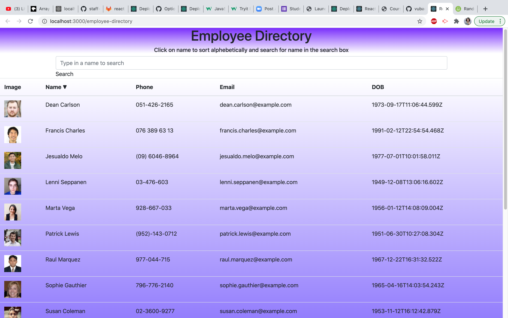

# employees-directory
Using react to create an employee directory. The page is populated with employees' images, names, phone numbers, email, and day of birth. The search bar allows user to look up employees name and when the name column is clicked, employees' names will be sort in alphabetical order





## Deployed-Link

[Deployed Link](https://vubao2303.github.io/employee-directory/)  

# Table of Contents 

| |||
|:-:|:-:|:-:|
|[Project Introduction](#employees-directory) | [Table of Contents](#table-of-contents) | [Deployed Link](#Deployed-Link) |  [Description of Page Building](#Description-of-Page-Building)| [Code Snippets](#code-snippet) 
| [Technologies Used](#Technologies-Used) |  [Author](#author) | [License](#License)

---

## Description of Page Building 
* InstallCreate React App globally by running `npx create-react-app react-app` in terminal
* In public folder contains the index.html file
   <ul> 
  <li> Bacic HTML doctype
  <li> Add bootstrap access link 
  <li> Contains root id so we can use to twist the page 
  </li>
  </ul>

* In src (source) folder
  <ul> 
  <li> Component folders 

  - Header.js file has title and information about the page

  <li> Style folder contains style.css file to decorate the interface
  <li> App.js file

  - Imports all components 

  - Create hooks 
  
  - Add sort and search funtion 
  
  - Render all the necessary components to set up the page 

  - In util folder 
  
  <li> images.json file contains all the roses pictures, each has an id, a name, an image link and a click with flase boleean value, 
  <li> index.js file render App component and send it to html 
  
  </li>
  </ul>


## Code Snippet
In terminal, run 
`npx create-react-app react-app`

To use components in  application
``` Javascript
ReactDOM.render(<App />, document.getElementById("root"));
```

Render html components 
``` Javascript
  return (
    <div>
      <Header />
      <Search />
      {/* ()=> call the function  */}
      <Table>
        <TableHead /> {users.map((user, index) => {
          return (
            <TableRows/>
          )})}
      </Table>
    </div>
  );
```

Creates components as independent and reusable bits of code
``` Javascript
import React from 'react';
function SearchForm(props) {
  return (
    <div className='SearchBar'>
      <input
        className='form-control'
        type='text'
        placeholder='Type in a name to search'
        aria-label='Search'
        onKeyUp= {props.onKeyUp}
      ></input>
    </div> ); }
export default SearchForm;
``` 

Get the props from App. js to dynamically generate tabel rows 
``` Javascript
function TableRows({ index,image, name, phone, email, dob }) {
  return (
    <tr>
      <td>
        
      </td>
      <td>{name}</td>
      <td>{phone}</td>
      <td>{email}</td>
      <td>{dob}</td>
    </tr>
  )
}
export default TableRows;
``` 

Import react and other components to App.js file
``` Javascript
import React, { useEffect, useState } from "react";
import Header from "./components/Header.js"
import Search from "./components/SearchForm.js"
import TableRows from "./components/TableRows.js"
import API from "./utils/API.js";
import Table from "./components/Table.js"
import TableHead from "./components/TableHead.js"
```

Set property in App.js file to send to other components 
``` Javascript 
  <TableRows
    index={index}
    image={user.image}
    name={user.firstname + " " + user.lastname}
    sortName= {sortName}
    phone={user.phone}
    email={user.email}
    dob={user.dob}
    key={index} />
```

## Technologies Used

||||||
|:-:|:-:|:-:|:-:|:-:|
|[HTML](https://developer.mozilla.org/en-US/docs/Web/HTML) | [CSS](https://developer.mozilla.org/en-US/docs/Web/CSS) | [React](https://reactjs.org/docs/getting-started.html) | [Javascript](https://developer.mozilla.org/en-US/docs/Web/JavaScript)  | [GitHub](https://github.com/)

<!-- |||||
|:-:|:-:|:-:|:-:|
|[Express](https://expressjs.com/) |[Node.js](https://nodejs.org/en/) | [Mongoose](https://mongoosejs.com/docs/defaults.html) | [Morgan](https://www.npmjs.com/package/morgan) -->


<br>

## Author

| | |
| --- | --- |
|**B Tram Vu**|[ LinkedIn](https://www.linkedin.com/in/b-tram-vu/) [ GitHub](https://github.com/vubao2303) | [ Portfolio](https://www.linkedin.com/in/b-tram-vu-866250121/)


---

## License

[](https://opensource.org/licenses/MIT)
